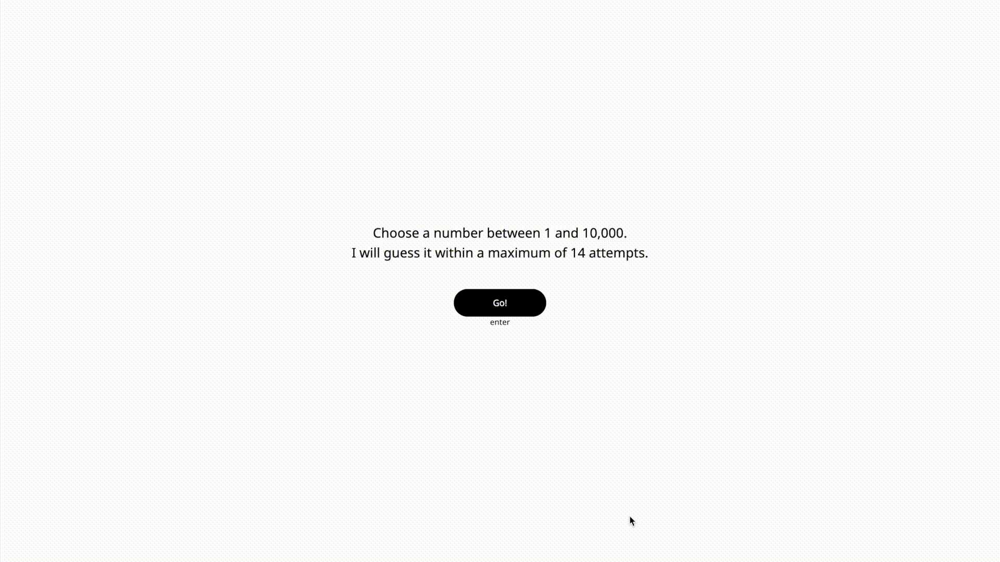

<h1 align="center">
  Binakinator
</h1>

  Online Demo: 
  <a href="https://ornate-hummingbird-37a6ef.netlify.app/">
    https://ornate-hummingbird-37a6ef.netlify.app/
  </a>

 
  

## Project description

Binakinator is a simple number guessing game implemented in React.js. The game's objective is to guess a number that you secretly choose within the range of 1 to 10,000. Binakinator uses a binary search algorithm to guess the number efficiently in a maximum of 14 attempts.

## How to Play

1. Open the Binakinator web application.
2. Think of a number between 1 and 10,000.
3. Binakinator will start guessing your number using binary search.
4. For each guess, you need to provide feedback by answering "higher" if your number is greater than the guess, or "lower" if it is smaller.
5. Binakinator will continue guessing until it finds your number or reaches the maximum limit of 14 attempts.

## Technology Stack

- React.js.
- HTML5.
- CSS3.

## 🚀 Try yourself

<a href="https://ornate-hummingbird-37a6ef.netlify.app/">
Check online demo
</a>

or
1. Clone the repository and open the directory in terminal.
2. Run `npm ci` or `npm i`.
3. Run `npm start`.
4. Open <a href="http://localhost:3000/">http://localhost:3000/</a>
